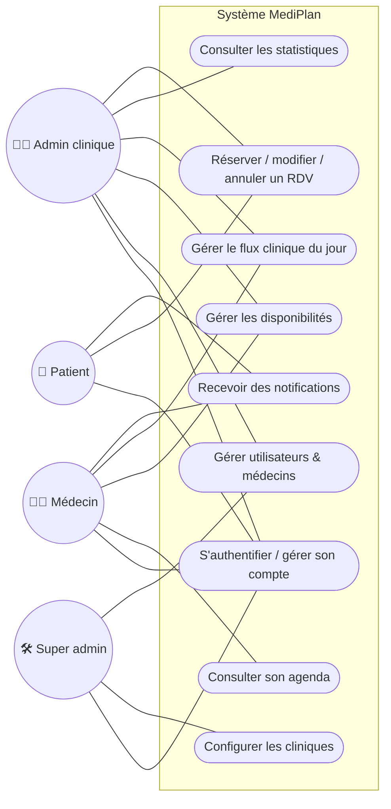

# Cas d'utilisation 1 — Vue d'ensemble du système

## Explication

Ce diagramme offre une **vue d'ensemble** des interactions entre les quatre acteurs et les
grandes fonctionnalités de MediPlan. Il montre comment les responsabilités se répartissent
selon le modèle RBAC : le patient se limite à la réservation et au suivi de ses rendez-vous ;
le médecin gère son agenda, ses disponibilités et le flux du jour ; l'administrateur de clinique
supervise les utilisateurs, les disponibilités et les statistiques de sa clinique ; le super
administrateur configure les cliniques.

**Lien avec le projet** : ce diagramme cadre l'ensemble du périmètre fonctionnel **Must** du
cahier des charges (EF-01 à EF-09) et sert de point d'entrée aux six diagrammes de cas
d'utilisation détaillés qui suivent. Il oriente le découpage en Epics du Sprint 1 et des sprints
suivants.
