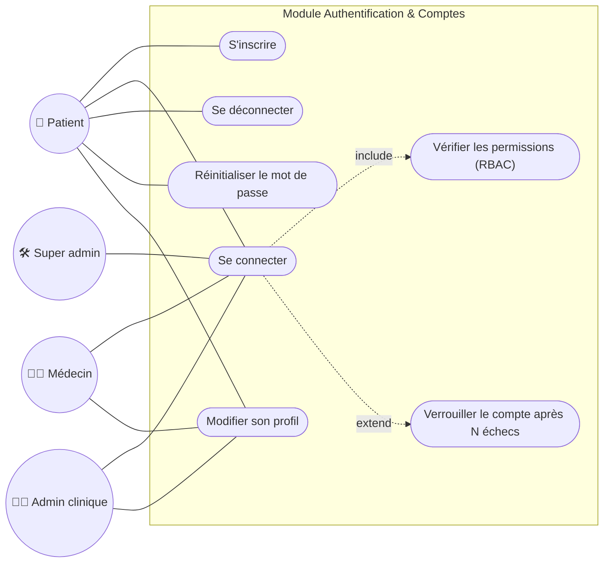

# Cas d'utilisation 2 — Authentification et gestion des comptes

**Fonctionnalités** : EF-01 (Authentification et gestion des comptes), EF-09 (RBAC)

## Explication

Ce diagramme représente le **module d'authentification et de gestion des comptes**, socle de
toute la sécurité applicative. Tout utilisateur peut se connecter, se déconnecter et gérer son
profil ; seul le patient peut **s'inscrire** librement (les autres comptes sont créés par un
administrateur ou un super administrateur). Deux relations UML sont mises en évidence : la
connexion **inclut** systématiquement une vérification des permissions RBAC (`include`), et elle
**peut être étendue** par un verrouillage temporaire du compte après plusieurs tentatives
échouées (`extend`), conformément aux exigences de sécurité OWASP du §3.3.

**Lien avec le Sprint 1** : l'authentification et le RBAC sont des fonctionnalités **Must**
(EF-01, EF-09) et un prérequis technique de toutes les autres ; elles constituent une des
premières Epics implémentées (Phase 2 — Développement backend).
