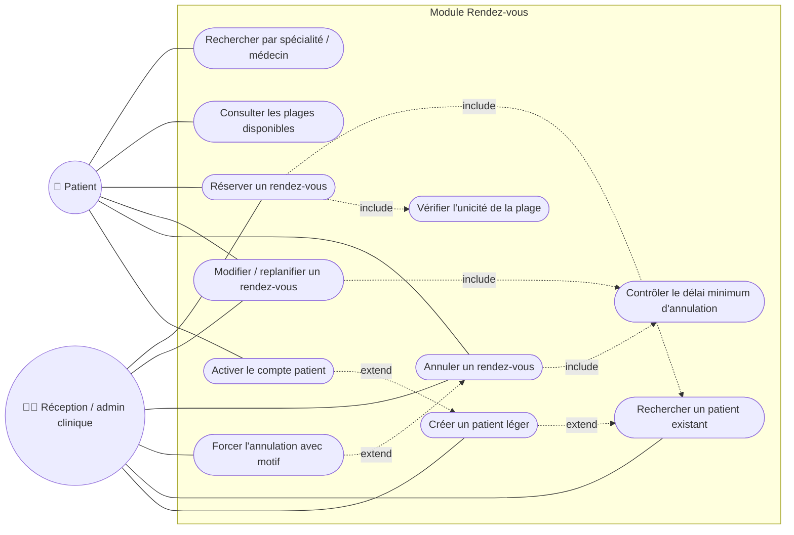

# Cas d'utilisation 3 — Réservation, modification et annulation de rendez-vous

**Fonctionnalité** : EF-05 — **Scénarios** : SC-01, SC-02

## Explication

Ce diagramme détaille le **cœur métier de MediPlan** : la réservation, la modification et
l'annulation de rendez-vous (EF-05). Le patient recherche une plage par spécialité ou médecin,
la réserve, puis peut la modifier ou l'annuler. Deux contrôles critiques sont modélisés en
`include` : la **vérification d'unicité de la plage** (qui garantit l'objectif OM-04 « éviter
les doubles réservations ») et le **contrôle du délai minimum d'annulation** (ex. 24 h). Lorsque
ce délai est dépassé, seul l'administrateur peut **forcer l'annulation** avec un motif (`extend`),
en agissant au nom du patient — ce qui illustre le scénario SC-02.

Le Sprint 3 introduit un flux Must pour la réception : un rendez-vous peut être pris au téléphone
pour un patient qui n'a pas encore de compte libre-service. Dans ce cas, la réception recherche
d'abord un patient existant ; si aucun dossier ne correspond, elle crée un **patient léger**
(`role=patient`, `clinic_id` renseigné, `email` et `password_hash` optionnels,
`is_self_registered=false`). Ce patient léger peut immédiatement être associé au rendez-vous.

Décision de cadrage : le patient léger peut réclamer/activer son compte plus tard. L'activation
ajoute un email unique, définit le mot de passe, passe `is_self_registered=true` et conserve le
même identifiant patient, donc le même historique de rendez-vous. Cette décision débloque
MEDIPLAN-21 et la story « RDV par la réception » sans imposer la création d'un compte numérique
au moment de l'appel.

**Lien avec le projet** : il s'agit de la fonctionnalité la plus prioritaire et la plus risquée
(risque R-02 du cahier des charges). Le détail du flux de réservation est approfondi dans le
[diagramme de séquence SEQ-01](../sequence/seq-01-reservation.md).
