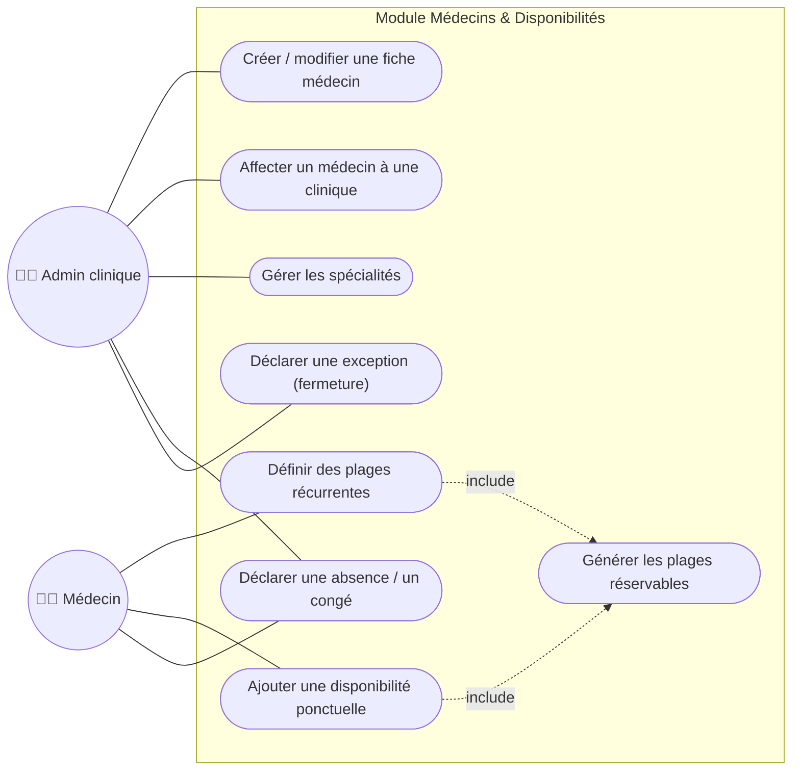

# Cas d'utilisation 4 — Gestion des médecins et des disponibilités

**Fonctionnalités** : EF-03 (Médecins et spécialités), EF-04 (Disponibilités)

## Explication

Ce diagramme couvre la **gestion des médecins et de leurs disponibilités**, qui alimente
directement le moteur de réservation. L'administrateur gère les fiches médecins, leur
affectation aux cliniques et les spécialités ; le médecin définit ses **plages récurrentes**
(ex. tous les lundis 9 h–12 h) et ses **disponibilités ponctuelles**, et déclare ses **absences
et congés**. La génération des plages réservables (`include`) traduit ces règles en créneaux
concrets proposés aux patients.

**Lien avec le projet** : la modélisation des disponibilités (récurrences, exceptions, congés)
est identifiée comme le risque technique **R-02** du cahier des charges, à prototyper tôt. Ce
module est un prérequis du module de réservation (EF-05) et fait l'objet d'une Epic dédiée.
