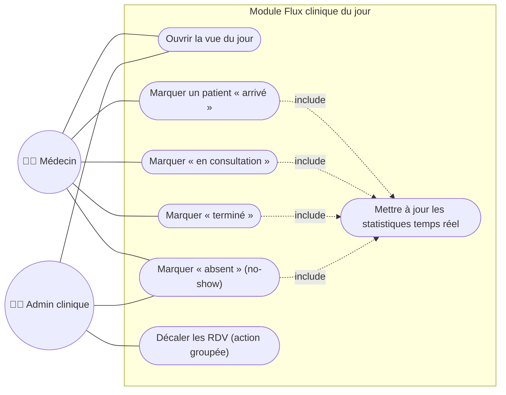

# Cas d'utilisation 5 — Flux clinique du jour

**Fonctionnalité** : EF-06 — **Scénario** : SC-03

## Explication

Ce diagramme représente la **gestion du flux clinique du jour** (EF-06), c'est-à-dire le suivi
en temps réel de la file d'attente d'une clinique. Le médecin fait progresser chaque rendez-vous
à travers ses statuts (arrivé → en consultation → terminé, ou absent). L'administrateur peut, en
cas de retard, **décaler en bloc** les rendez-vous d'un médecin (action groupée du scénario
SC-03). Chaque changement de statut **met à jour les statistiques en temps réel** (`include`),
notamment le taux de no-show suivi dans les tableaux de bord.

**Lien avec le projet** : cette fonctionnalité **Must** matérialise l'objectif OM-02 (vue claire
de l'horaire du jour) et alimente l'objectif OM-07 (statistiques). Elle dépend du module de
rendez-vous et précède le module de statistiques (EF-08).
