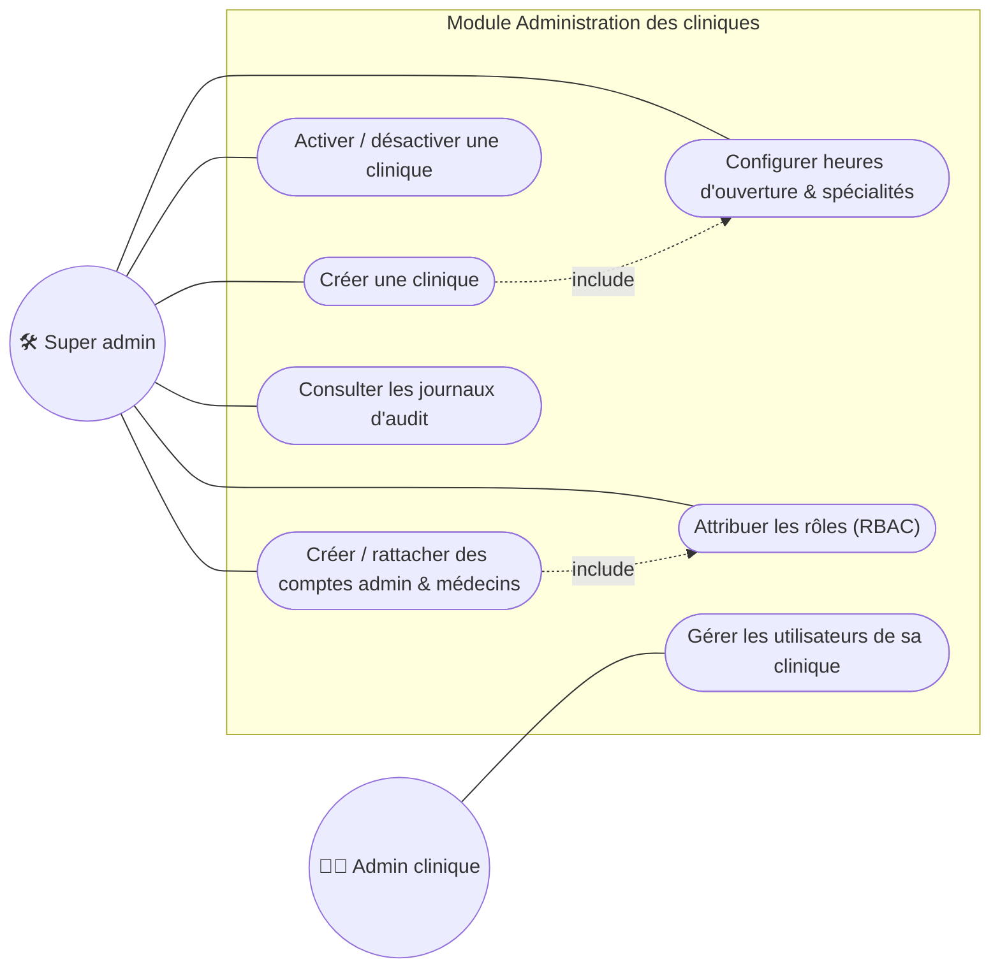

# Cas d'utilisation 6 — Administration des cliniques

**Fonctionnalité** : EF-02 — **Scénario** : SC-04

## Explication

Ce diagramme décrit la **configuration multi-cliniques** réservée au super administrateur
(EF-02, scénario SC-04). Celui-ci crée une clinique, configure ses heures d'ouverture et ses
spécialités, rattache les comptes administrateurs et médecins, et attribue automatiquement les
rôles RBAC (`include`). Une clinique peut être **désactivée sans être supprimée**, afin de
préserver l'historique. L'administrateur de clinique, lui, ne gère que les utilisateurs de **sa**
clinique, ce qui illustre le cloisonnement strict des données (séparation par `clinic_id`).

**Lien avec le projet** : ce module établit la **séparation logique des données entre cliniques**
(objectif OM-05) et le principe du moindre privilège (OM-06). Il conditionne la création des
jeux de données de démonstration utilisés dans les autres modules.
