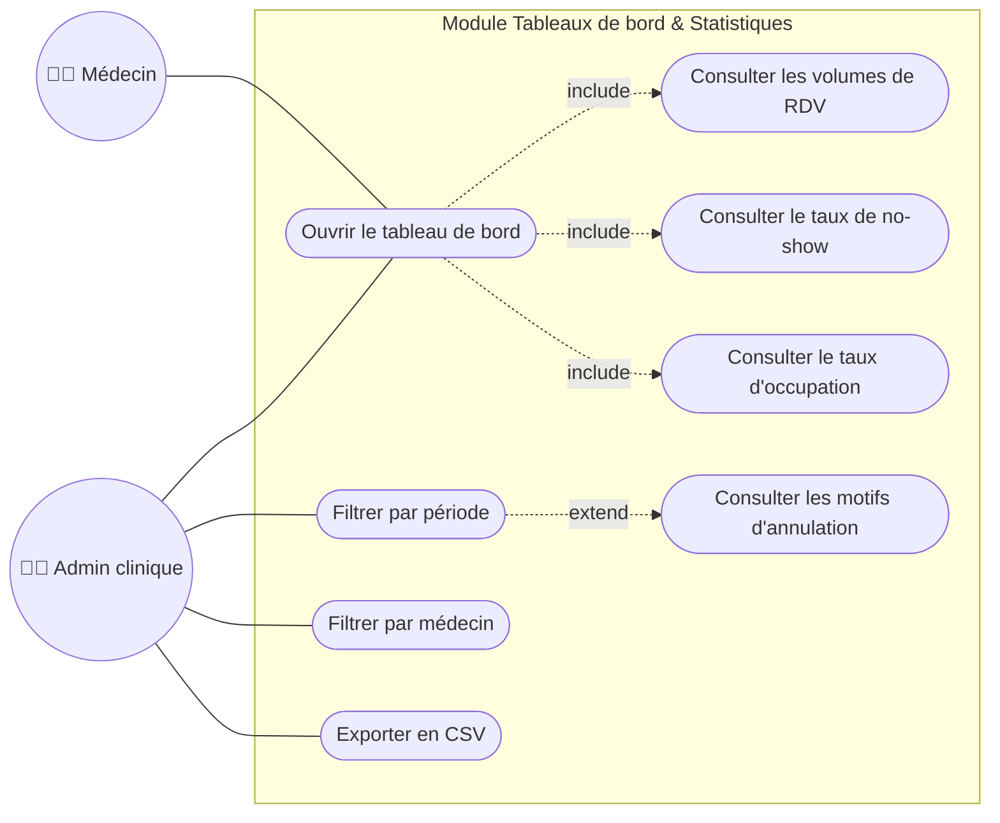

# Cas d'utilisation 7 — Tableaux de bord et statistiques

**Fonctionnalité** : EF-08 (+ EF-10 export) — **Scénario** : SC-05

## Explication

Ce diagramme présente la **consultation des statistiques** par l'administrateur de clinique
(EF-08, scénario SC-05). Depuis le tableau de bord, il filtre par période et par médecin, puis
consulte les indicateurs clés : volumes de rendez-vous, taux de no-show, taux d'occupation et
motifs d'annulation. Les données peuvent être **exportées en CSV** (EF-10, priorité *Could*) à
des fins de reporting. Lorsqu'une période contient peu de données, un avertissement est affiché
plutôt qu'un graphique vide (variante du scénario SC-05).

**Lien avec le projet** : ce module sert l'objectif OM-07 (statistiques utiles au suivi de
l'activité) et les indicateurs de succès KPI. Sa priorité *Should* le place après les
fonctionnalités **Must**, mais sa conception est anticipée car il dépend des données produites
par le flux clinique (EF-06).
