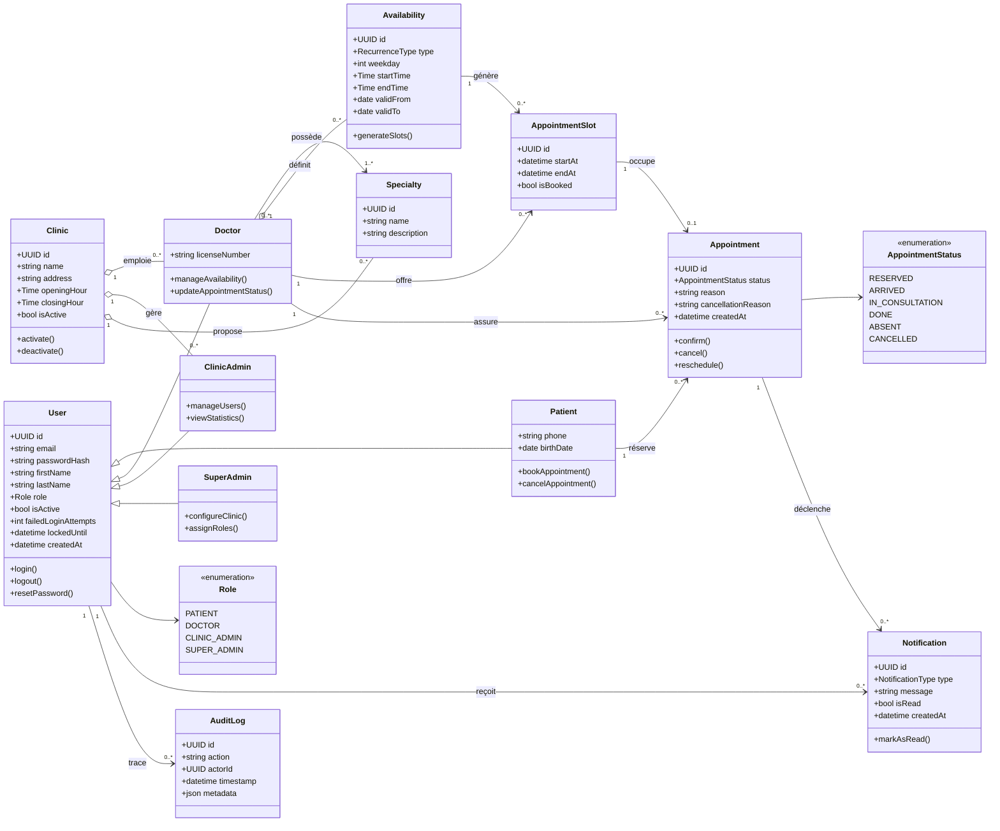

# Diagramme de classes — Domaine MediPlan

## Explication

Ce diagramme de classes modélise le **domaine métier** de MediPlan et constitue la base du schéma
relationnel PostgreSQL (objectif OP-04, 3ᵉ forme normale).

- **Héritage des rôles** : la classe abstraite `User` centralise l'identité et l'authentification
  (email, hash du mot de passe, verrouillage). Les quatre rôles (`Patient`, `Doctor`,
  `ClinicAdmin`, `SuperAdmin`) en héritent, ce qui reflète le modèle RBAC (EF-09). L'énumération
  `Role` matérialise le contrôle d'accès.
- **Organisation des cliniques** : une `Clinic` agrège ses médecins, administrateurs et
  spécialités. Le rattachement à une clinique porte le cloisonnement des données (`clinic_id`,
  objectif OM-05).
- **Disponibilités et créneaux** : un `Doctor` définit des `Availability` (récurrentes ou
  ponctuelles) qui **génèrent** des `AppointmentSlot` réservables — c'est le module à risque R-02.
- **Rendez-vous** : un `Appointment` occupe **au plus un** `AppointmentSlot` (relation 0..1
  garantissant l'unicité, donc l'absence de double réservation — OM-04, ENF-PERF-05). Son cycle
  de vie est porté par l'énumération `AppointmentStatus` (réservé → arrivé → en consultation →
  terminé / absent / annulé), utilisée par le flux clinique du jour (EF-06).
- **Notifications et audit** : `Notification` matérialise les notifications internes (EF-07) et
  `AuditLog` la journalisation des actions sensibles exigée par la sécurité (§3.3).

**Lien avec le projet** : ce diagramme guide directement la conception des entités TypeORM/Prisma
et des migrations PostgreSQL (Phase 2). La contrainte d'unicité `AppointmentSlot → Appointment`
sera traduite en contrainte d'unicité en base, pilier de la fiabilité des réservations.
