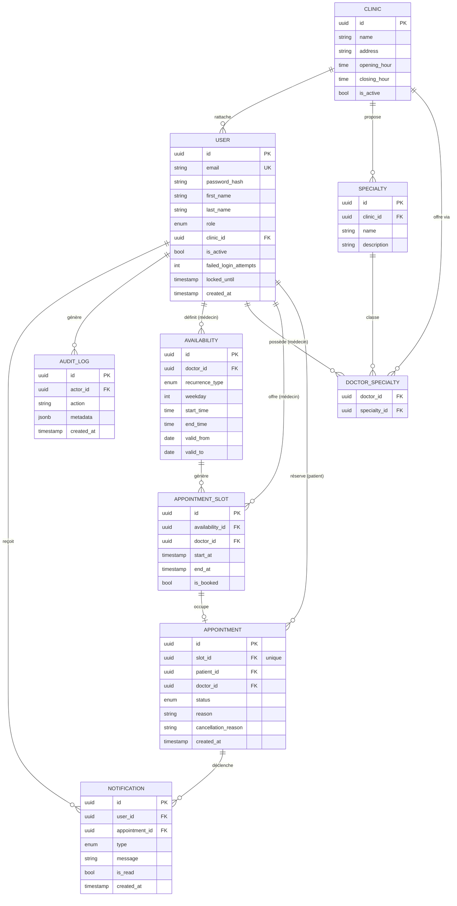

# Diagramme entité-association (MCD / ERD) — Base PostgreSQL

## Explication

Ce diagramme entité-association traduit le [diagramme de classes](../classes/diagramme-classes.md)
en **modèle relationnel** prêt pour PostgreSQL (objectif OP-04, 3ᵉ forme normale). Quelques
choix de conception notables :

- **Cloisonnement multi-cliniques** : la colonne `clinic_id` sur `USER` et `SPECIALTY` porte la
  séparation logique des données entre cliniques (OM-05), filtrée systématiquement côté API.
- **Relation many-to-many** : `DOCTOR_SPECIALTY` est une table d'association entre médecins et
  spécialités, conforme à la normalisation.
- **Unicité de réservation** : la clé étrangère `slot_id` sur `APPOINTMENT` est marquée **unique
  (UK)** : un créneau ne peut être lié qu'à un seul rendez-vous actif, ce qui empêche toute
  double réservation au niveau du stockage (OM-04, ENF-PERF-05).
- **Index** : des index sont prévus sur les colonnes de recherche fréquente (`clinic_id`,
  `doctor_id`, `start_at`) pour respecter les exigences de performance (ENF-PERF-01 à 03).

**Lien avec le projet** : ce modèle est la cible des migrations versionnées de l'ORM
(TypeORM/Prisma) en Phase 2. Il complète les livrables UML attendus (LIV-06) et constitue le
support du livrable LIV-03 (schéma PostgreSQL versionné).
