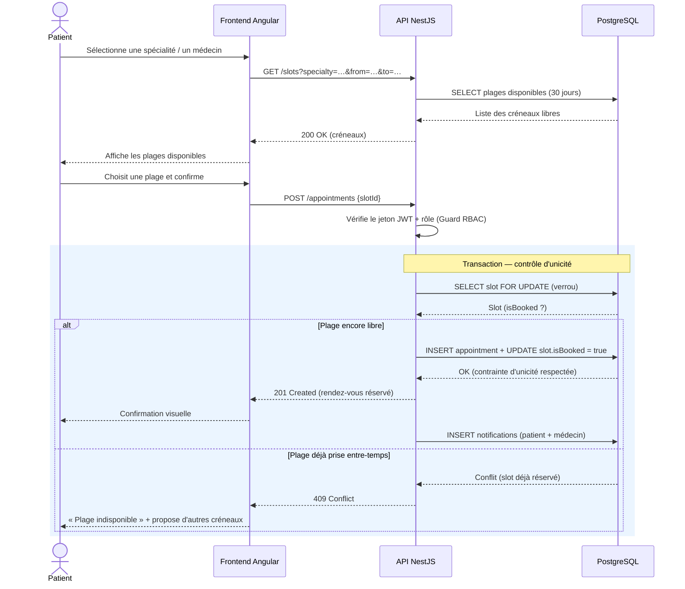

# Diagramme de séquence 1 — Réserver un rendez-vous

**Scénario** : SC-01 — **Fonctionnalité** : EF-05 — **Objectif** : OM-04 (anti-double-réservation)

## Explication

Ce diagramme de séquence détaille le **flux nominal et le cas d'erreur** de la réservation d'un
rendez-vous (SC-01), à travers les trois tiers de l'architecture : Frontend Angular → API NestJS
→ PostgreSQL. Le patient consulte d'abord les créneaux disponibles, puis confirme un choix.

Le point critique est la **transaction de réservation** : l'API verrouille la plage
(`SELECT … FOR UPDATE`) et s'appuie sur une **contrainte d'unicité en base** avant d'insérer le
rendez-vous. Si la plage a été prise entre l'affichage et la confirmation (accès concurrent),
le système renvoie un `409 Conflict` et propose d'autres créneaux — ce qui garantit l'objectif
**OM-04** et l'exigence **ENF-PERF-05** (aucune double réservation, même en concurrence).

**Lien avec le Sprint 1** : ce scénario est le plus prioritaire (EF-05, *Must*) et le plus
sensible du projet ; sa conception soignée prévient le risque R-02. Il sera couvert par un test
d'intégration simulant deux réservations simultanées (KPI-02 : 0 % de doubles réservations).
