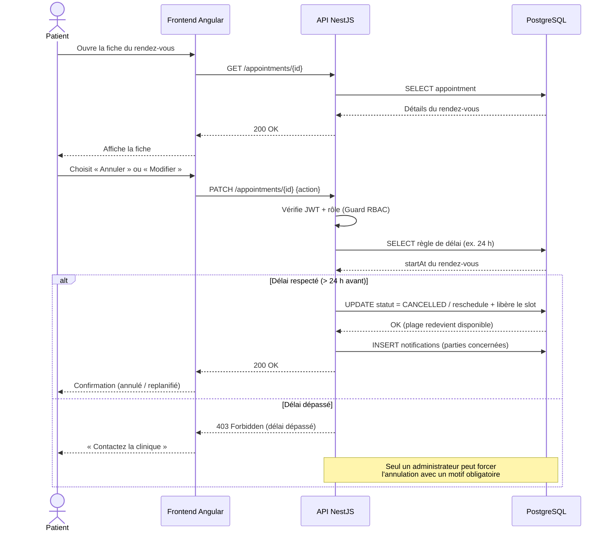

# Diagramme de séquence 2 — Annuler ou modifier un rendez-vous

**Scénario** : SC-02 — **Fonctionnalité** : EF-05

## Explication

Ce diagramme représente l'**annulation et la modification d'un rendez-vous** (SC-02). Après avoir
ouvert la fiche, le patient demande l'annulation ou la replanification. L'API applique alors la
**règle de délai minimum** (ex. 24 h) : si le délai est respecté, le statut passe à `CANCELLED`
ou `RESCHEDULED`, la **plage redevient disponible** et les parties sont notifiées. Si le délai
est dépassé, l'action est refusée (`403 Forbidden`) et seul un **administrateur** peut forcer
l'annulation avec un motif obligatoire — la variante d'escalade du scénario SC-02.

**Lien avec le projet** : ce flux complète le cycle de vie du rendez-vous (EF-05) et libère les
créneaux pour de nouvelles réservations, soutenant l'objectif OM-03 (réduction de la charge
administrative). La gestion fine des statuts s'appuie sur l'énumération `AppointmentStatus` du
[diagramme de classes](../classes/diagramme-classes.md).
