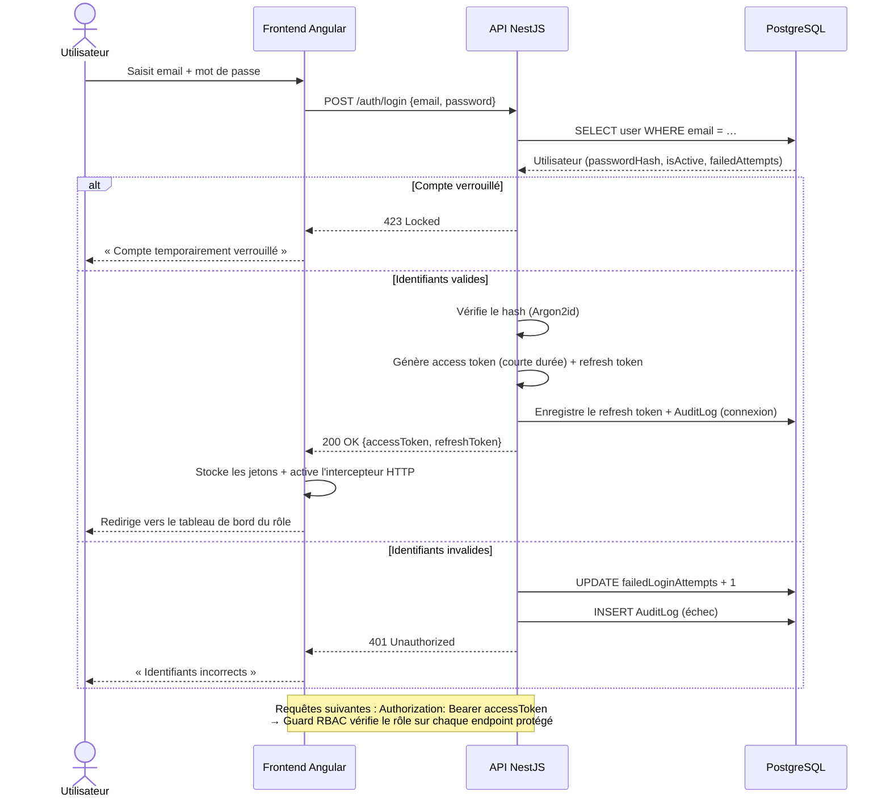

# Diagramme de séquence 3 — Authentification (connexion JWT)

**Fonctionnalité** : EF-01 — **Sécurité** : §3.3 (OWASP, JWT, RBAC)

## Explication

Ce diagramme décrit le **processus d'authentification** (EF-01) et la mise en place de la
sécurité par jetons. L'API vérifie le mot de passe via un **hachage Argon2id** (jamais en clair),
puis émet un **access token à courte durée de vie** et un **refresh token** conformément aux
recommandations OWASP du §3.3. Trois cas sont modélisés : compte verrouillé (`423`),
authentification réussie (génération des jetons + journalisation), et échec (incrément du
compteur de tentatives, qui déclenche le verrouillage après N essais — EF-01).

Une fois connecté, le frontend joint le jeton à chaque requête (`Authorization: Bearer`), et un
**Guard RBAC** côté NestJS vérifie le rôle sur chaque endpoint protégé (EF-09). Toute action
sensible est tracée dans `AuditLog`.

**Lien avec le projet** : l'authentification est un prérequis **Must** de toutes les autres
fonctionnalités et le socle de la stratégie de sécurité (objectifs OM-06, OP-03). C'est l'une des
premières Epics développées en Phase 2.
