# Manuel d'utilisation — MediPlan

**Plateforme web de gestion des rendez-vous médicaux**
Collège La Cité · projet intégrateur 030747 · Printemps 2026

Ce manuel s'adresse aux **utilisateurs** de MediPlan, pas aux développeurs. Il
montre, écran par écran, comment se servir de l'application. Pour installer ou
lancer la solution, voir le [README du dépôt](../../README.md).

> 🎬 **La vidéo de démonstration** ([`MediPlan-Demo.mp4`](../../MediPlan-Demo.mp4),
> 4 min) parcourt le même chemin que ce manuel, commenté à voix haute. Les deux
> se complètent : la vidéo pour voir, le manuel pour retrouver.

---

## Sommaire

1. [À quoi sert MediPlan](#1--à-quoi-sert-mediplan)
2. [Accéder à l'application](#2--accéder-à-lapplication)
3. [Se connecter, s'inscrire, récupérer son mot de passe](#3--se-connecter-sinscrire-récupérer-son-mot-de-passe)
4. [**Réception** — la journée d'une clinique](#4--réception--la-journée-dune-clinique)
5. [**Médecin** — ma journée et mes disponibilités](#5--médecin--ma-journée-et-mes-disponibilités)
6. [**Patient** — prendre rendez-vous soi-même](#6--patient--prendre-rendez-vous-soi-même)
7. [Réglages communs](#7--réglages-communs)
8. [Ce que l'application ne fait pas](#8--ce-que-lapplication-ne-fait-pas)
9. [En cas de problème](#9--en-cas-de-problème)

---

## 1 · À quoi sert MediPlan

MediPlan remplace l'agenda papier et le tableur partagé d'une petite clinique par
un agenda unique, partagé entre la réception et les médecins.

Il répond à cinq irritants concrets :

| Le problème | Ce que MediPlan fait |
|---|---|
| Deux personnes réservent le même créneau | La base **refuse** la seconde réservation. Ce n'est plus une question de vigilance |
| Un rendez-vous annulé fait perdre le créneau | L'annulation **libère** le créneau, qui redevient immédiatement réservable |
| Personne ne sait où en est la journée | Le **flux du jour** est partagé : réception et médecin voient le même état |
| Le patient doit se créer un compte pour exister | Le **patient léger** est créé au comptoir, sans mot de passe à retenir |
| Aucune donnée pour piloter la clinique | Volumes, taux d'absence et taux d'occupation, calculés en direct |

### Quatre rôles

| Rôle | Ce qu'il voit |
|---|---|
| **Administrateur de clinique** (la réception) | Tout, pour sa clinique : disponibilités, rendez-vous, flux du jour, statistiques, utilisateurs |
| **Médecin** | Son tableau de bord, ses disponibilités, le flux du jour |
| **Patient** | Ses propres rendez-vous, et la prise de rendez-vous |
| **Super administrateur** | Supervision de l'ensemble des cliniques |

**Chaque utilisateur ne voit que les données de sa clinique.** Ce n'est pas une
question d'affichage : le serveur refuse toute requête qui sortirait de ce
périmètre.

---

## 2 · Accéder à l'application

MediPlan s'utilise **dans un navigateur**, sans rien installer.

**Adresse :**
`https://ca-mediplan-frontend.ashytree-9ad5012f.canadacentral.azurecontainerapps.io`

> ⏱️ **Le premier accès prend 10 à 15 secondes.** C'est normal : l'application
> s'arrête complètement quand personne ne l'utilise, et doit se réveiller. Une
> fois réveillée, la navigation est instantanée.

### Comptes de démonstration

| Rôle | Identifiant | Mot de passe | Affiche |
|---|---|---|---|
| Réception | `admin.demo@mediplan.test` | `Adm1n!Secret` | Alice Tremblay |
| Médecin | `doctor.demo@mediplan.test` | `Doct0r!Secret` | Sophie Bergeron |
| Patient | `patient.demo@mediplan.test` | `Pat1ent!Secret` | Julie Caron |

Ces comptes contiennent **uniquement des données fictives**. Aucune donnée réelle
de patient n'est manipulée par la plateforme.

### Navigateurs

Chrome et Edge (deux dernières versions), sur ordinateur, tablette (≥ 768 px) ou
téléphone (≥ 360 px).

---

## 3 · Se connecter, s'inscrire, récupérer son mot de passe

### Se connecter

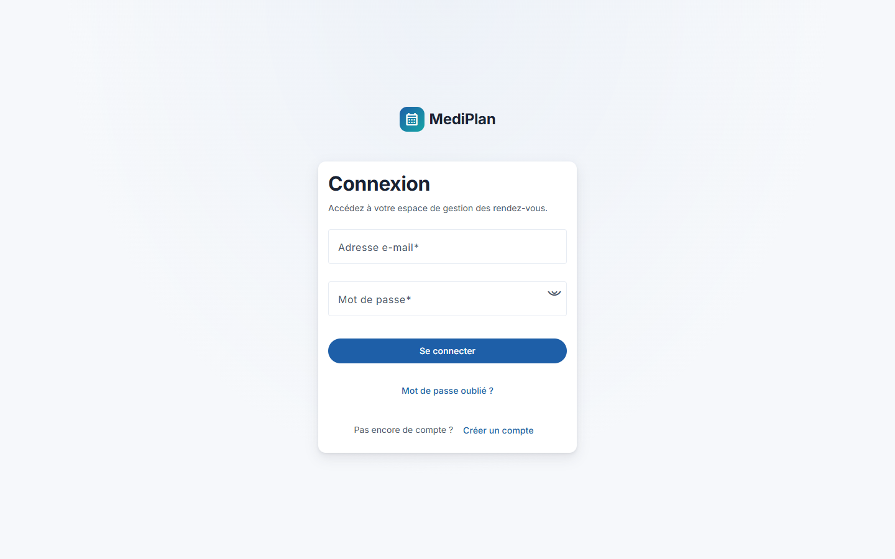

Saisir l'adresse e-mail et le mot de passe, puis **Se connecter**.

> 🔒 **Après cinq tentatives échouées, le compte se verrouille temporairement.**
> C'est une protection contre les tentatives de deviner un mot de passe. Il suffit
> d'attendre, ou de passer par « Mot de passe oublié ».

### S'inscrire — patients uniquement

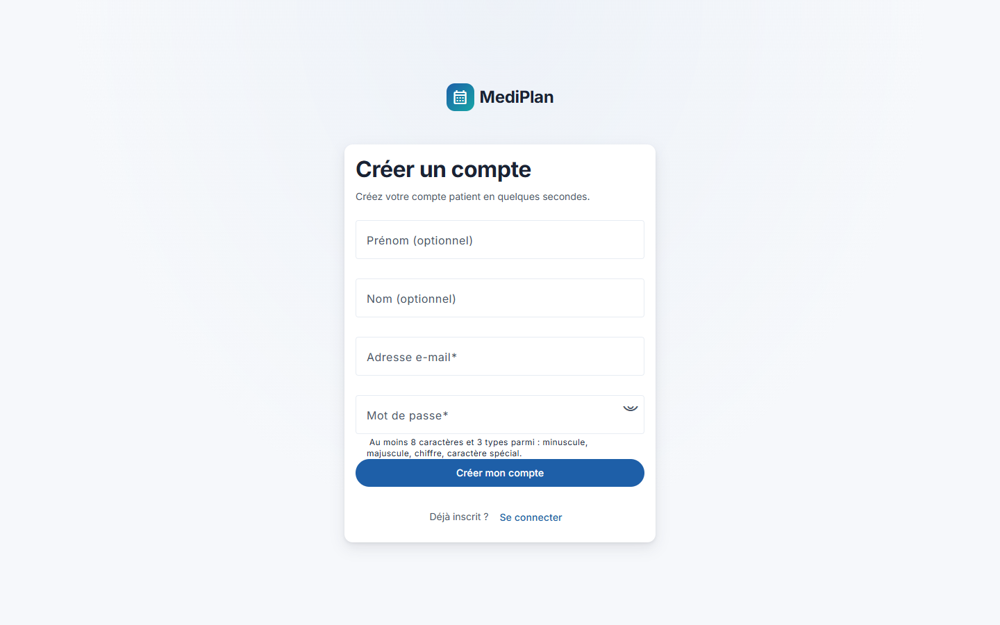

L'inscription est réservée aux **patients**. On y choisit sa clinique dans
l'annuaire : c'est elle qui déterminera les médecins et les créneaux proposés.

Les comptes **médecin** et **réception** ne s'auto-créent pas : ils sont créés par
l'administration de la clinique.

> **Le mot de passe doit être solide.** L'écran indique en direct ce qui manque
> tant que la règle n'est pas respectée.

### Mot de passe oublié

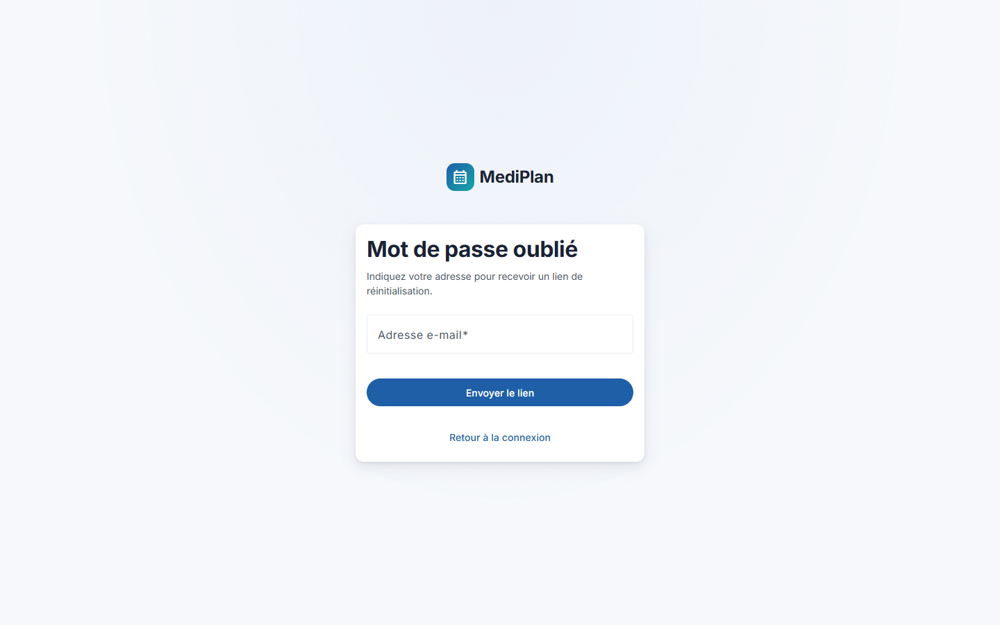

Saisir son adresse e-mail et suivre le lien de réinitialisation reçu.

---

## 4 · Réception — la journée d'une clinique

C'est le rôle principal de MediPlan : la personne qui décroche le téléphone.
Les six sections qui suivent racontent une journée dans l'ordre.

### 4.1 · Le tableau de bord


À la connexion, trois tuiles portant sur **la journée en cours** :

- le **nombre de rendez-vous** du jour ;
- les **médecins qui consultent** aujourd'hui — un médecin en congé n'est pas
  compté ;
- le **taux de remplissage** de leurs créneaux.

Ces chiffres sont **calculés en base**, pas saisis. Les deux premières tuiles sont
cliquables et mènent à l'écran correspondant.

> ⚠️ L'accès rapide **« Médecins »** est grisé et porte la mention *bientôt* :
> cet écran n'existe pas encore. C'est volontairement visible plutôt que masqué.

### 4.2 · Publier une plage de disponibilité

**Menu de gauche → Disponibilités → Ajouter une plage**

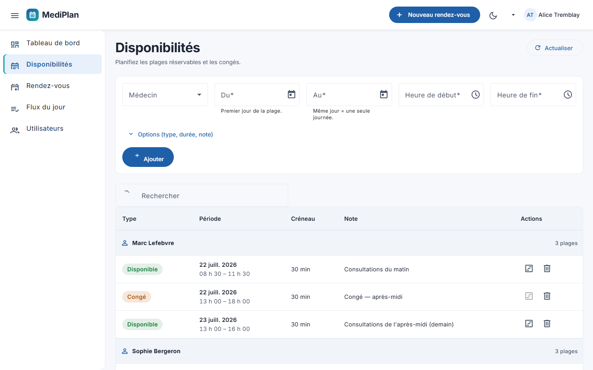

| Champ | Ce qu'on saisit |
|---|---|
| **Médecin** | Dans la liste déroulante |
| **Du** / **Au** | La date, **par l'icône du calendrier** |
| **Heure de début / de fin** | Les bornes de la plage |
| **Durée d'un créneau** | En minutes — 30 par exemple |

**C'est le geste le plus utile de l'application** : à la validation, MediPlan
**génère tout seul** les créneaux réservables. Une plage de 9 h à 12 h en créneaux
de 30 minutes produit 6 créneaux, sans qu'on ait rien saisi de plus. Le nombre est
annoncé avant de valider.

Les **congés** se posent de la même façon : une plage marquée comme indisponible.

> ⚠️ **Une plage qui porte des rendez-vous ne peut pas être supprimée.**
> L'application le refuse volontairement — il faut d'abord annuler les rendez-vous
> concernés. Cela évite de faire disparaître des rendez-vous sans s'en rendre
> compte.

### 4.3 · Réserver pour un patient au téléphone

**Bouton « Nouveau rendez-vous » dans la barre du haut**

Le dialogue annonce sa promesse : *« Médecin, créneau, patient — trois gestes. »*

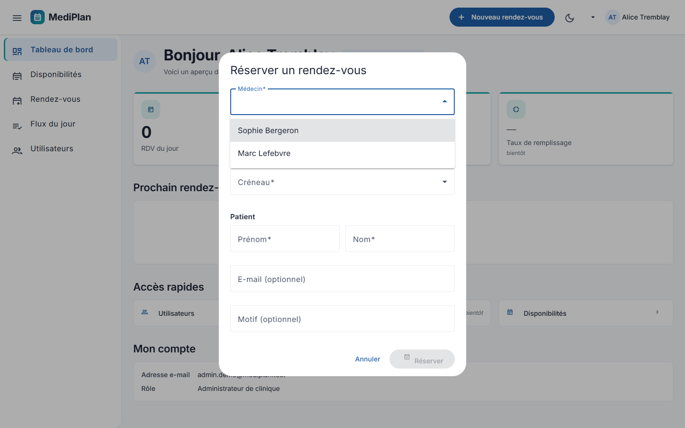

**1 · Le médecin.** La liste indique le **nombre de créneaux libres** de chacun :
on ne propose jamais un choix qui ne mène nulle part.

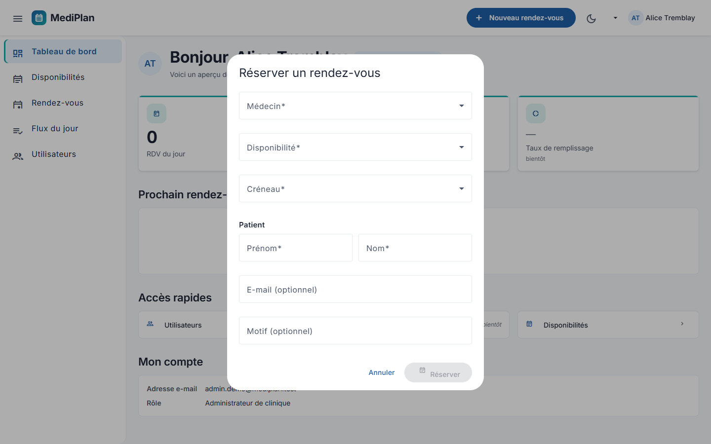

**2 · La disponibilité, puis le créneau.** Seuls les créneaux **réellement libres**
apparaissent. Un créneau déjà pris a disparu de la liste.

**3 · Le patient.** Prénom, nom, motif.

> **Le patient n'a pas besoin de compte.** MediPlan crée un **patient léger** : un
> patient existant dans le système, créé au comptoir, sans mot de passe. C'est la
> traduction du fait qu'un patient de clinique appelle — il ne s'inscrit pas.

Cliquer **Réserver**. L'application bascule sur la liste des rendez-vous, la
réservation en tête.

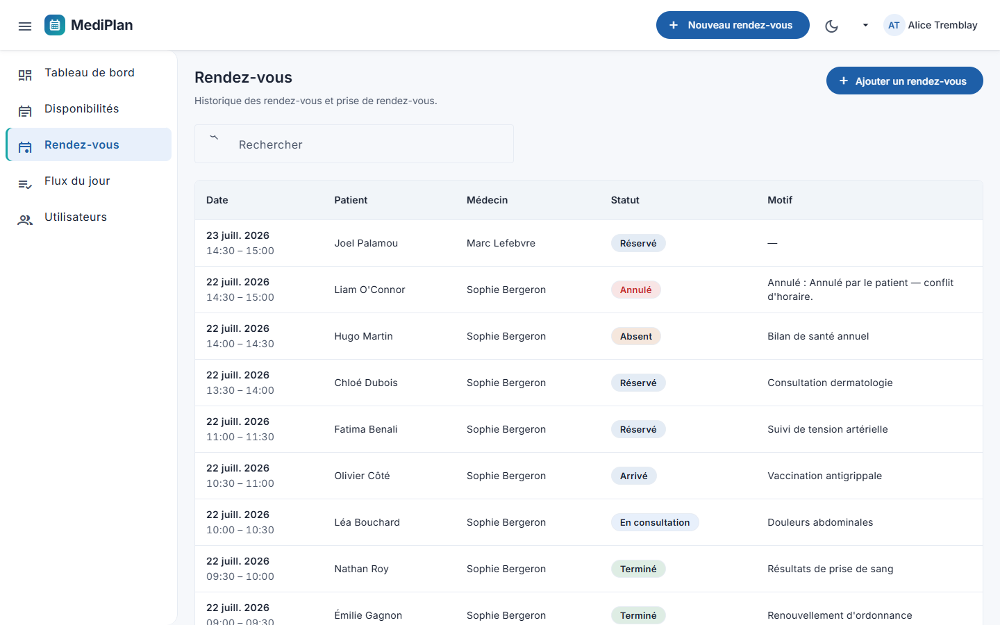

La liste se filtre par statut et par période.

### 4.4 · Suivre la journée — le flux du jour

**Menu de gauche → Flux du jour**

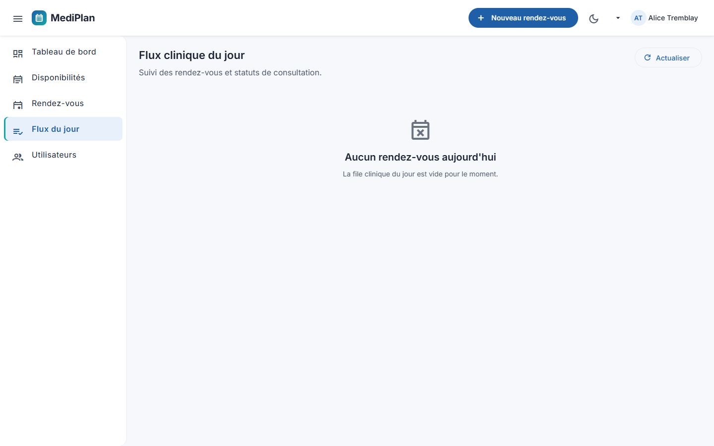

L'écran central de la journée, **partagé entre la réception et le médecin**.
Les rendez-vous sont groupés en trois blocs — **À venir**, **Présents**,
**Clôturés** — et chacun suit un cycle de vie :

```
Réservé  →  Arrivé  →  En consultation  →  Terminé
                                        ↘  Absent
```

Sur chaque ligne, un bouton fait passer à l'étape suivante :

1. **Marquer arrivé** — le patient est au comptoir ;
2. **Démarrer la consultation** — il est entré ;
3. **Terminer** — une **confirmation** s'ouvre avant de valider.

> **Pourquoi une confirmation seulement à la fin ?** Les statuts terminaux
> (*Terminé*, *Absent*) demandent confirmation parce qu'ils clôturent le
> rendez-vous. Les étapes intermédiaires, non : on ne ralentit pas un geste
> répété cinquante fois par jour.

### 4.5 · Annuler un rendez-vous

**Flux du jour → bouton ⋯ sur la ligne → Annuler le rendez-vous**

**Le motif est obligatoire.** Tant que le champ est vide, le bouton **Confirmer
l'annulation** reste inactif. Ce n'est pas une politesse d'interface : c'est une
règle métier — une annulation sans raison n'apprend rien à la clinique.

Une fois confirmée :

> « Le rendez-vous de … a été annulé. **Le créneau est de nouveau disponible.** »

Et c'est littéralement vrai : rouvrez « Nouveau rendez-vous » sur la même plage,
le créneau est revenu dans la liste. **Un créneau annulé n'est pas un créneau
perdu.**

### 4.6 · Exporter les rendez-vous

**Flux du jour → champs Du / Au dans l'en-tête → Exporter CSV**

Le fichier s'ouvre dans n'importe quel tableur — pour la comptabilité ou un
rapport mensuel. **L'export ne contient que les données de votre clinique.**

### 4.7 · Les statistiques

**Menu de gauche → Statistiques**

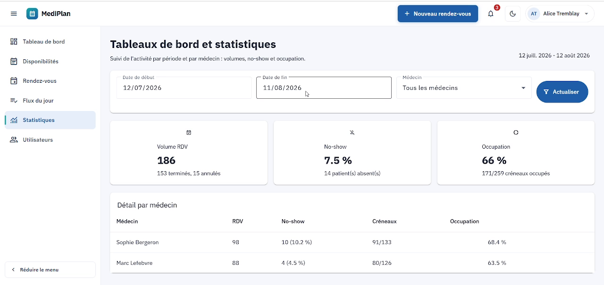

Trois indicateurs sur la période choisie (30 derniers jours par défaut),
filtrables par médecin :

| Indicateur | Ce qu'il signifie pour la clinique |
|---|---|
| **Volume RDV** | L'activité brute, avec le détail terminés / annulés |
| **No-show** | Les patients absents. C'est **du temps médecin payé et non facturé** |
| **Occupation** | Le taux de créneaux occupés. Il répond à : *faut-il ouvrir plus de plages ?* |

Le **détail par médecin** ventile les trois chiffres, avec une barre d'occupation.

### 4.8 · Gérer les utilisateurs

**Menu de gauche → Utilisateurs**

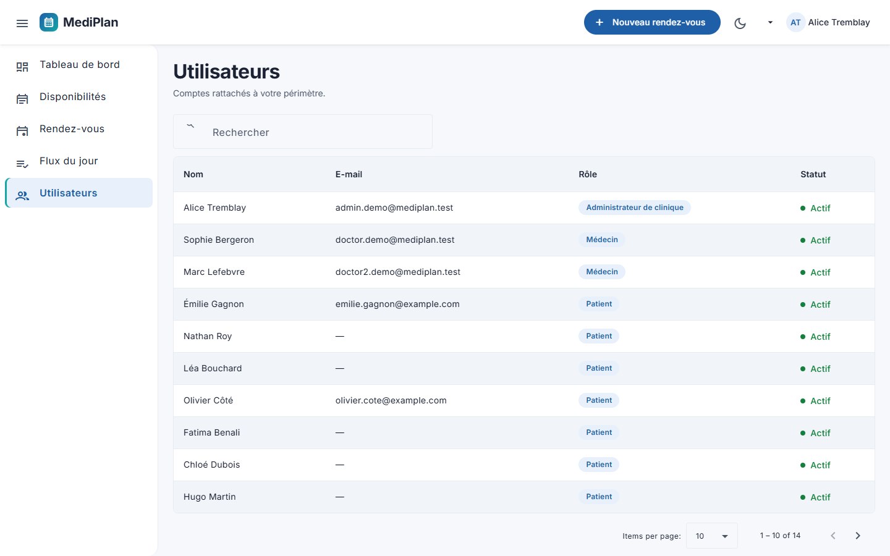

La liste des comptes de **votre clinique** — jamais des autres. Cet écran
n'apparaît que pour le rôle administrateur.

---

## 5 · Médecin — ma journée et mes disponibilités

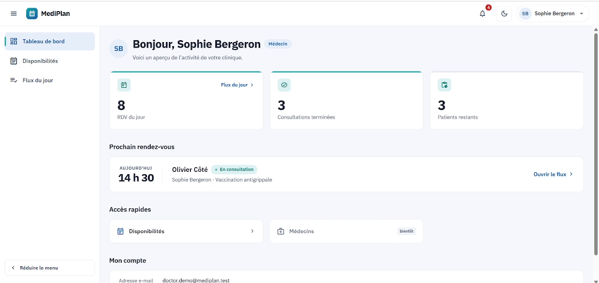

**Comparez cette capture avec celle de la réception (§ 4.1)** — c'est la même
application et le même code, mais :

- le menu de gauche n'a que **trois entrées** : Tableau de bord, Disponibilités,
  Flux du jour. Plus de *Rendez-vous*, plus de *Statistiques*, plus
  d'*Utilisateurs* ;
- le bouton **« Nouveau rendez-vous » a disparu** de la barre du haut ;
- l'en-tête porte le badge **Médecin**.

> **Ce n'est pas qu'un affichage.** Si un médecin saisissait à la main l'adresse
> de l'écran Statistiques, le serveur la lui refuserait. Le menu ne fait que
> refléter une règle appliquée côté serveur.

Le tableau de bord du médecin affiche ses rendez-vous du jour, ses consultations
terminées, les patients restants, et **son prochain rendez-vous** avec un lien
direct vers le flux.

**La cloche de notifications** se remplit toute seule : une notification est émise
à chaque réservation, à chaque changement de statut et à chaque annulation
concernant le médecin. Il n'a rien à faire pour être tenu au courant.

---

## 6 · Patient — prendre rendez-vous soi-même

C'est le **second canal** : jusqu'ici tout passait par la réception, ici le
patient se sert lui-même.

Après connexion, l'écran est volontairement pauvre : **deux entrées de menu**, pas
de bouton « Nouveau rendez-vous », et la liste de ses propres rendez-vous.

### Prendre un rendez-vous

**Mes rendez-vous → Prendre un rendez-vous**

1. **Le médecin** — la liste annonce le nombre de créneaux libres de chacun ;
2. **La date et l'heure** — les créneaux sont **groupés par journée** ;
3. **Le motif** — puis **Confirmer**.

### Consulter ses rendez-vous

**Mes rendez-vous** liste les rendez-vous à venir et passés, avec leur statut.

> **Les deux canaux partagent le même agenda.** Un créneau pris par un patient
> depuis chez lui disparaît immédiatement de la liste de la réception, et
> inversement. Les deux réservations empruntent la **même transaction, le même
> verrou et le même index** : la garantie ne dépend pas du canal utilisé.

> ⚠️ **Un patient ne peut pas annuler lui-même.** C'est délibéré — voir § 8.

---

## 7 · Réglages communs

### Le menu utilisateur

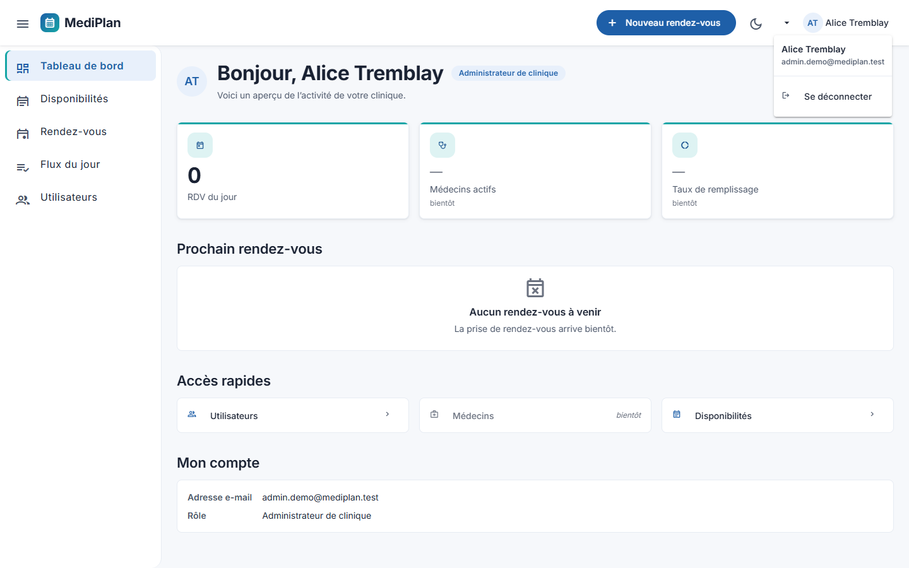

En haut à droite : le nom, le rôle, et **Se déconnecter**.

### Le mode sombre

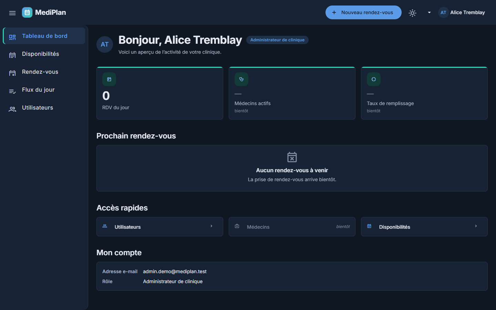

L'**icône de lune** dans la barre du haut bascule toute l'interface en thème
sombre. Le choix est mémorisé. Aucun écran n'a été retouché à la main : toute
l'interface lit les mêmes variables de design.

### Sur téléphone

| | |
|---|---|
| 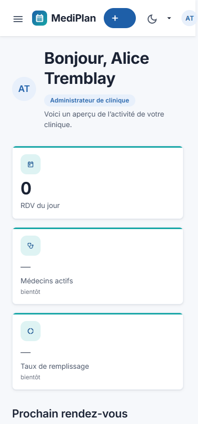 | 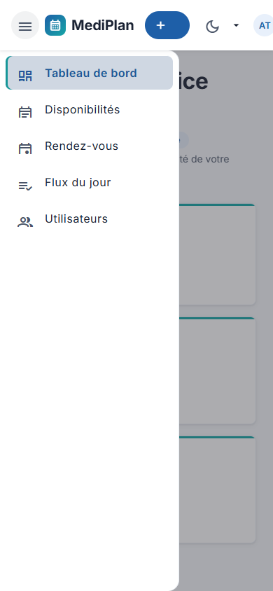 |

L'interface s'adapte à partir de **360 px**. Le menu de gauche devient un tiroir,
ouvert par l'icône en haut à gauche.

---

## 8 · Ce que l'application ne fait pas

Nous préférons l'écrire que de le laisser découvrir.

| Ce qui n'existe pas | Pourquoi |
|---|---|
| **Modifier / déplacer un rendez-vous** | Non implémenté. Il faut annuler puis réserver à nouveau |
| **Annulation par le patient** | Suppose une règle de délai minimum (24 h avant, par exemple) que nous n'avons pas implémentée. Nous préférons ne pas livrer une annulation sans sa règle |
| **Gestion des médecins par l'interface** | L'écran n'existe pas — l'accès rapide est grisé et le dit |
| **Configuration d'une clinique par l'interface** | Idem |
| **Décaler en bloc les rendez-vous d'un médecin** | Codé et testé, mais non intégré au produit |
| **Rappels par courriel ou SMS** | Aucune notification ne sort de l'application. Les notifications sont internes |
| **Disponibilités récurrentes** | Les plages sont **datées**. Une plage hebdomadaire se saisit semaine par semaine |
| **Mode hors ligne** | Une connexion est nécessaire |

Ces limites et l'ordre dans lequel nous les traiterions sont détaillés dans le
[cahier des charges v2.0](../cahier-des-charges/Cahier-des-charges-v2.md), § 1.3
et annexe C.

---

## 9 · En cas de problème

| Symptôme | Que faire |
|---|---|
| **La page met 10 à 15 secondes à s'ouvrir** | Normal au premier accès : l'application se réveille. Les suivants sont instantanés |
| **« Identifiants invalides »** alors que le mot de passe est bon | Le compte est peut-être **verrouillé** après cinq échecs. Attendre, ou passer par « Mot de passe oublié » |
| **Je suis déconnecté sans avoir rien fait** | La session dure 60 minutes. Se reconnecter |
| **Le créneau que je veux n'apparaît pas** | Il est déjà pris. Les créneaux occupés sont retirés de la liste |
| **Je ne peux pas supprimer une plage** | Elle porte des rendez-vous. Les annuler d'abord |
| **Le bouton « Confirmer l'annulation » reste gris** | Le **motif** est obligatoire |
| **Une entrée de menu a disparu** | Elle n'existe pas pour votre rôle. C'est le contrôle d'accès, pas un bogue |
| **L'accès rapide « Médecins » ne réagit pas** | Il est grisé : l'écran n'existe pas encore |

---

*Manuel rédigé le 12 août 2026. Les captures d'écran proviennent de l'application
déployée ; chaque libellé cité a été observé, pas supposé.*
